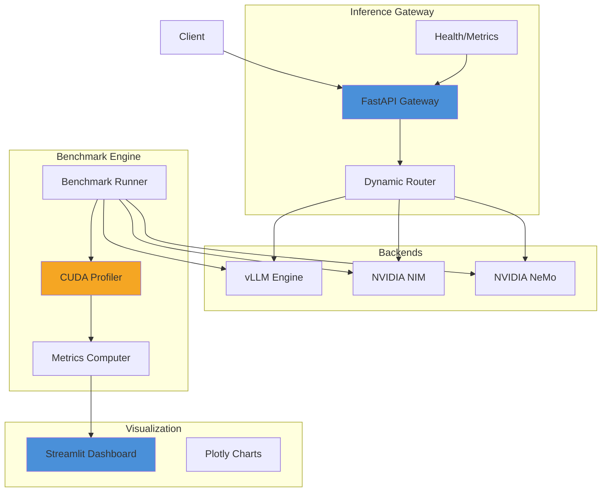

# InferIQ

[](https://opensource.org/licenses/Apache-2.0)
[](https://www.python.org/downloads/)
[](https://github.com/astral-sh/ruff)

**Production-grade, open-source GPU-optimized LLM serving benchmark and inference gateway.**

InferIQ demonstrates enterprise-level GPU inference engineering by benchmarking and comparing LLM inference across vLLM, NVIDIA NIM, and NVIDIA NeMo on single and multi-GPU setups. It features CUDA kernel-level profiling, a FastAPI inference gateway with dynamic routing, and a Streamlit dashboard for comprehensive visualization.

## Overview

InferIQ is a comprehensive framework for:

- **Benchmarking** LLM inference across multiple backends (vLLM, NVIDIA NIM, NVIDIA NeMo)
- **Profiling** GPU utilization at the CUDA kernel level with Chrome trace export
- **Serving** models through a FastAPI gateway with load balancing and autoscaling readiness
- **Visualizing** throughput, latency (p50/p95/p99), GPU memory, and cost-per-token metrics

### Key Features

| Feature | Description |
|---------|-------------|
| Multi-Backend Support | Benchmark vLLM, NVIDIA NIM, and NVIDIA NeMo side-by-side |
| CUDA Profiling | Kernel-level profiling with torch.profiler, Chrome trace export |
| Dynamic Routing | Round-robin, least-latency, and least-loaded routing strategies |
| OpenAI API Compatible | Drop-in replacement for OpenAI API endpoints |
| Kubernetes Native | HPA support for autoscaling based on GPU metrics |
| Cost Analysis | Per-token cost estimation based on GPU-hour pricing |

## Architecture



## Quick Start

### Installation

```bash
# Clone the repository
git clone https://github.com/inferiq/inferiq.git
cd inferiq

# Install with pip (editable mode)
pip install -e .

# Or install with optional dependencies
pip install -e ".[vllm,nemo]"
```

### Run Benchmarks

```bash
# Run with default configuration
python scripts/run_benchmark.py

# Run with custom config
python scripts/run_benchmark.py --config configs/custom.yaml

# Run specific models
python scripts/run_benchmark.py --model mistral-7b-instruct-vllm --model llama-3-8b-nim
```

### Start the Gateway

```bash
# Start FastAPI gateway
python -m src.gateway.app

# Or using uvicorn directly
uvicorn src.gateway.app:app --host 0.0.0.0 --port 8000
```

### Launch Dashboard

```bash
# Start Streamlit dashboard
streamlit run dashboard/app.py
```

## Configuration

### Model Registry

Configure available models in `configs/models.yaml`:

```yaml
registry:
  - name: "mistral-7b-instruct-vllm"
    display_name: "Mistral 7B Instruct (vLLM)"
    model_id: "mistralai/Mistral-7B-Instruct-v0.2"
    backend: "vllm"
    parameters:
      size: "7B"
      context_length: 32768
    config:
      tensor_parallel_size: 1
      gpu_memory_utilization: 0.90
```

### Benchmark Configuration

Configure benchmark sweep in `configs/default.yaml`:

```yaml
benchmark:
  prompt_lengths: [128, 256, 512, 1024]
  batch_sizes: [1, 4, 8, 16, 32]
  max_tokens: [128, 256]
  warmup_runs: 3
  measured_runs: 10
  gpu_pricing:
    a100_40gb: 2.50
    h100: 4.50
```

## Running Benchmarks

### Command Line Interface

```bash
# Basic usage
inferiq-benchmark --config configs/default.yaml

# With options
python scripts/run_benchmark.py \
    --config configs/default.yaml \
    --model mistral-7b-instruct-vllm \
    --output results/custom \
    --resume
```

### Programmatic Usage

```python
from src.benchmark.runner import BenchmarkRunner
from src.config.settings import get_settings

settings = get_settings()
runner = BenchmarkRunner(config=settings.benchmark)

# Run full sweep
results = await runner.run()

# Run specific configuration
results = await runner.run(
    models=[model_config],
    prompt_lengths=[128, 256],
    batch_sizes=[1, 4, 8],
)
```

## API Reference

### OpenAI-Compatible Endpoints

| Endpoint | Description |
|----------|-------------|
| `GET /v1/models` | List available models |
| `POST /v1/completions` | Text completion |
| `POST /v1/chat/completions` | Chat completion |
| `GET /health` | Liveness probe |
| `GET /ready` | Readiness probe |
| `GET /metrics` | Prometheus metrics |

### Example Request

```bash
curl http://localhost:8000/v1/completions \
  -H "Content-Type: application/json" \
  -d '{
    "model": "mistral-7b-instruct-vllm",
    "prompt": "Hello, world!",
    "max_tokens": 50
  }'
```

## Dashboard

The Streamlit dashboard provides interactive visualization of benchmark results:

- **Latency Analysis**: Violin plots, percentile charts, heatmaps
- **Throughput Analysis**: Bar charts, efficiency frontiers
- **GPU Monitoring**: Memory usage, utilization timelines
- **Backend Comparison**: Side-by-side metric comparison

```bash
streamlit run dashboard/app.py
```

Access the dashboard at `http://localhost:8501`.

## Deployment

### Docker Compose

```bash
# Start all services
docker-compose up -d

# Start with vLLM worker
docker-compose --profile vllm up -d

# Run benchmarks in container
docker-compose --profile benchmark run --rm benchmark
```

### Kubernetes

Deploy to a GPU-enabled Kubernetes cluster:

```bash
# Create namespace and deploy
kubectl apply -f k8s/

# Or deploy components individually
kubectl apply -f k8s/configmap.yaml
kubectl apply -f k8s/deployment-gateway.yaml
kubectl apply -f k8s/deployment-vllm.yaml
kubectl apply -f k8s/service-gateway.yaml
kubectl apply -f k8s/hpa-gateway.yaml
```

### Helm Chart (Optional)

```bash
# Install with Helm
helm repo add inferiq https://inferiq.github.io/charts
helm install inferiq inferiq/inferiq \
    --set gateway.replicas=3 \
    --set vllm.enabled=true
```

## Results

Benchmark results are saved as structured JSON files in the `results/` directory:

```json
{
  "model_name": "mistral-7b-instruct-vllm",
  "backend": "vllm",
  "prompt_length": 128,
  "batch_size": 8,
  "latency": {
    "ttft_p50_ms": 45.2,
    "ttft_p95_ms": 52.1,
    "total_time_p50_ms": 98.5,
    "total_time_p95_ms": 115.3
  },
  "throughput": {
    "tokens_per_second": 1250.5
  },
  "cost": {
    "cost_per_1k_tokens": 0.0012
  }
}
```

Trace files in Chrome JSON format can be viewed at `chrome://tracing`.

## Project Structure

```
inferiq/
├── README.md
├── pyproject.toml
├── Dockerfile
├── docker-compose.yml
├── configs/
│   ├── default.yaml              # Benchmark configuration
│   └── models.yaml               # Model registry
├── src/
│   ├── gateway/                  # FastAPI inference gateway
│   │   ├── app.py               # Main application
│   │   ├── router.py            # Dynamic routing
│   │   ├── middleware.py        # Request logging
│   │   ├── health.py            # Health probes
│   │   └── schemas.py           # Pydantic models
│   ├── backends/                 # Backend implementations
│   │   ├── base.py              # Abstract backend
│   │   ├── vllm_backend.py      # vLLM wrapper
│   │   ├── nim_backend.py       # NVIDIA NIM client
│   │   └── nemo_backend.py      # NeMo wrapper
│   ├── benchmark/                # Benchmark engine
│   │   ├── runner.py            # Orchestrator
│   │   ├── workloads.py         # Prompt generation
│   │   ├── metrics.py           # Statistics computation
│   │   └── profiler.py          # CUDA profiling
│   ├── config/                   # Configuration
│   │   └── settings.py          # Pydantic settings
│   └── utils/                    # Utilities
│       ├── gpu.py               # GPU monitoring
│       └── logging.py           # Structured logging
├── dashboard/                    # Streamlit dashboard
│   ├── app.py                   # Main dashboard
│   └── components/              # Chart components
├── k8s/                          # Kubernetes manifests
│   ├── deployment-gateway.yaml
│   ├── deployment-vllm.yaml
│   ├── service-gateway.yaml
│   ├── hpa-gateway.yaml
│   └── configmap.yaml
├── tests/                        # Test suite
│   ├── test_gateway.py
│   ├── test_backends.py
│   └── test_benchmark.py
└── scripts/                      # CLI utilities
    ├── run_benchmark.py
    └── export_traces.py
```

## Contributing

Contributions are welcome! Please read our [Contributing Guide](CONTRIBUTING.md) for details on:

- Code style (ruff, mypy)
- Testing requirements
- Pull request process

### Development Setup

```bash
# Install dev dependencies
pip install -e ".[dev]"

# Run tests
pytest

# Run linting
ruff check .
ruff format .

# Run type checking
mypy src/
```

## License

This project is licensed under the Apache License 2.0 - see the [LICENSE](LICENSE) file for details.

## Acknowledgments

- [vLLM](https://github.com/vllm-project/vllm) - High-throughput LLM serving
- [NVIDIA NIM](https://developer.nvidia.com/nim) - Optimized inference microservices
- [NVIDIA NeMo](https://github.com/NVIDIA/NeMo) - Generative AI framework
